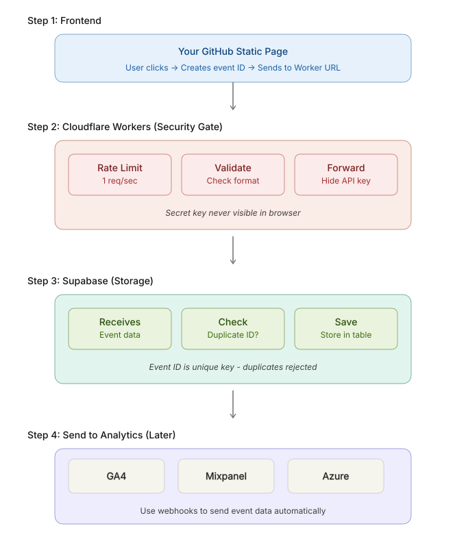

# Secure Event Tracker

A lightweight, secure, serverless event tracking architecture built using:

- GitHub Pages (Frontend)
- Cloudflare Workers (Security & API Gateway)
- Supabase (Event Storage)

This project demonstrates how to collect user interaction events from a static website while keeping database credentials secure and preventing duplicate event insertion.

---

## Architecture

<p align="center">
  
</p>

---

## Event Flow

### Step 1: Frontend

The frontend generates analytics events whenever a user performs an action.

Examples:

- Home Page Impression
- Scan QR Click
- Relay Toggle Click
- Send Request Click
- Payment Success Impression

The frontend:

1. Creates a unique Event ID
2. Attaches session and device metadata
3. Sends the event to a Cloudflare Worker

---

### Step 2: Cloudflare Worker

Cloudflare Workers act as the security layer.

Responsibilities:

- Rate limiting
- Request validation
- Event schema validation
- Hiding Supabase credentials
- Forwarding valid events to Supabase

No database secrets are ever exposed to the browser.

---

### Step 3: Supabase

Supabase stores analytics events.

Each event contains a unique:

```text
event_id
```

which prevents duplicate insertion.

Example:

```sql
event_id TEXT UNIQUE NOT NULL
```

If the same event is received twice, Supabase automatically rejects the duplicate.

Stored metadata includes:

- User ID
- Session ID
- Page URL
- Device Type
- Browser Language
- Screen Resolution
- Timestamp
- Source
- Custom Metadata

---

### Step 4: Analytics Layer

The stored events can later be forwarded to:

- Google Analytics 4
- Mixpanel
- Azure Analytics
- Custom Dashboards

using webhooks or scheduled jobs.

---

## Security Features

### API Key Protection

Supabase Service Role Keys remain inside Cloudflare Workers.

The browser never receives database credentials.

### Event Validation

All incoming requests are validated before processing.

### Duplicate Prevention

Each event receives a unique UUID.

```json
{
  "event_id": "4119af59-51f8-4bdc-a61b-18766542ed6e"
}
```

Duplicate events are rejected automatically.

### Rate Limiting

Cloudflare Worker rate limits incoming requests to reduce abuse.

---

## Example Event

```json
{
  "event_id": "4119af59-51f8-4bdc-a61b-18766542ed6e",
  "event_type": "toggle_click",
  "feature": "relay_toggle",
  "timestamp": "2026-06-05T10:41:03.705Z",
  "user_id": "54620eb5-5461-4ab5-bdb1-e8fca6ce8917",
  "session_id": "c41f7eeb-8cce-47ec-a2b0-3f38e4df848b",
  "source": "guide"
}
```

---

## Why This Architecture?

Traditional frontend analytics often expose backend endpoints or secrets.

This architecture provides:

- Secure event collection
- Serverless deployment
- Duplicate prevention
- Easy analytics integrations
- Low operational cost
- Scalable infrastructure

---

## Tech Stack

| Layer | Technology |
|---------|------------|
| Frontend | GitHub Pages |
| API Gateway | Cloudflare Workers |
| Storage | Supabase |
| Runtime | JavaScript |
