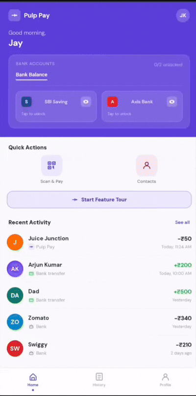

<div align="center">


<br/>
<br/>

<p>
  
  
  
  
  
</p>

<br/>

<h3>
A fallback payment layer for UPI when your bank fails at the worst possible moment.
</h3>

<p>
Built as a product concept and interactive prototype exploring how trusted-contact assisted payments could work natively inside existing UPI apps.
</p>

<br/>

<a href="https://sksaikiran.github.io/Pulp-Pay/">
  
</a>

</div>

---

# The Problem

You scan a QR.

Your bank shows:

> “UPI server error”

The merchant is waiting.
People behind you are staring.
You have internet.
Your phone works.
But the payment still fails.

India processes billions of UPI transactions every month, yet there is still no native fallback experience when a user's bank temporarily goes down.

Most people solve this manually:

* Calling a friend
* Sending QR screenshots on WhatsApp
* Asking someone nearby to pay
* Retrying endlessly

Pulp Pay reimagines this experience directly inside the payment flow.

---

# The Idea

Pulp Pay introduces a simple fallback mode inside the existing UPI payment screen.

Instead of abandoning the payment after a bank failure, users can instantly request someone they trust to complete the transaction on their behalf.

No app switching.
No awkward coordination.
No QR sharing.

---

# Core Experience

<div align="center">

| Mode         | Experience                                       |
| ------------ | ------------------------------------------------ |
| **Bank**     | Standard UPI payment                             |
| **Pulp Pay** | Send a live payment request to a trusted contact |

</div>

---

# How It Works




```text
Scan QR
   ↓
Bank server error
   ↓
Switch to Pulp Pay
   ↓
Select trusted contact
   ↓
Slide to send request
   ↓
Contact receives live payment notification
   ↓
Contact taps Pay
   ↓
Merchant receives payment confirmation
```

---

# Why This Matters

### Native fallback during bank failures

Instead of abandoning the payment, users instantly continue through a trusted payer.

### Built on existing UPI rails

Uses UPI collect request behavior that already exists today.

### Cross-app compatible

Requester and payer do not need to use the same UPI application.

### Socially seamless

Removes the awkward real-world friction of failed payments in public places.

### No behavior change

Users continue using the same QR flow they already know.

---
## Technical Architecture

Pulp Pay is designed as a product feature concept built on top of existing UPI infrastructure rather than introducing a new payment network.

The concept combines multiple UPI primitives that already exist today, including:

* UPI Collect Requests
* Merchant QR payments
* Device binding
* Push notifications
* UPI PIN authentication
* Real-time bank routing
* Cross-app interoperability

According to [NPCI UPI Overview](https://www.npci.org.in/what-we-do/upi/product-overview/?utm_source=chatgpt.com), UPI already supports both:

* **Push transactions** → user sends money
* **Pull / Collect transactions** → user requests money from another user

Pulp Pay extends the existing collect-request architecture into a merchant-payment fallback experience. ([NPCI][1])

---

# Existing UPI Architecture Behind Pulp Pay

<div align="center">

| Existing UPI Component | Standard UPI Terminology      | How Pulp Pay Uses It                  |
| ---------------------- | ----------------------------- | ------------------------------------- |
| Merchant QR Payment    | Push Transaction              | Initial payment attempt               |
| Collect Request        | Pull Transaction              | Trusted-contact fallback request      |
| PSP Apps               | Payment Service Provider Apps | Google Pay, PhonePe, Paytm, BHIM etc. |
| VPA                    | Virtual Payment Address       | Trusted-contact identification        |
| Device Binding         | Mobile + SIM verification     | Prevent unauthorized approvals        |
| UPI PIN                | Two-Factor Authentication     | Final payment authorization           |
| NPCI Switch            | UPI Transaction Routing Layer | Real-time payment orchestration       |
| Push Notifications     | Collect Request Alerting      | Instant payment approval flow         |

</div>

---

# Proposed Product Flow


```text
Merchant QR Scan
       ↓
Payment failure detected
       ↓
Pulp Pay fallback layer activates
       ↓
Trusted contact selected
       ↓
UPI Collect Request generated
       ↓
NPCI routes request to payer PSP
       ↓
Trusted contact receives push notification
       ↓
Payer reviews merchant + amount
       ↓
UPI PIN authentication
       ↓
Transaction routed through NPCI switch
       ↓
Merchant settlement completed
```

---

# Architecture Concept


```text
Merchant QR
      ↓
PSP App (PhonePe / GPay / Paytm)
      ↓
Pulp Pay Delegation Layer
      ↓
Collect Request Engine
      ↓
NPCI UPI Switch
      ↓
Trusted Contact PSP
      ↓
UPI PIN Authentication
      ↓
Settlement to Merchant Bank
```

---

# Why This Is Technically Feasible

According to [NPCI Documentation](https://www.npci.org.in/what-we-do/upi/product-overview/?utm_source=chatgpt.com), UPI already supports:

* Peer-to-peer collect requests
* Real-time payment notifications
* Cross-bank interoperability
* QR-based merchant payments
* Device-level authentication
* PIN-based transaction authorization

Pulp Pay does not require a completely new payment rail.

It primarily introduces:

* New orchestration logic
* Failure-detection triggers
* Trusted-contact routing
* Delegated payment UX flows

on top of existing NPCI-supported transaction behavior. ([NPCI][1])

---

# Security Architecture

Security is central to the concept.

Pulp Pay does not bypass UPI security systems.
It extends the existing UPI trust architecture.

---

## 1. Device Binding

UPI already uses device binding through SIM and device verification during onboarding and transaction flows. ([GitHub][2])

Pulp Pay relies on the same mechanism to ensure approval requests are only actionable on authenticated devices.

This prevents:

* Session hijacking
* Unauthorized approvals
* Remote spoofing attempts

---

## 2. UPI PIN Authentication

Every payment still requires explicit payer authorization through UPI PIN authentication.

The PIN is encrypted and handled through bank-controlled authentication layers rather than exposed directly to the app. ([GitHub][2])

This means:

* Pulp Pay never stores UPI PINs
* PIN validation remains bank-side
* NPCI security standards remain intact

---

## 3. Trusted Contact Graph

Only pre-approved trusted contacts can receive fallback requests.

This introduces a consent-based payment delegation model rather than open collect-request spam.

Possible controls could include:

* Contact whitelisting
* Daily delegation limits
* Relationship scoring
* Fraud-risk heuristics
* Cooldown periods

---

## 4. Merchant Verification Layer

Before approval, the payer can review:

* Merchant name
* Merchant VPA
* Amount
* Requester identity
* Timestamp
* QR metadata

This reduces blind approvals and phishing-style collect scams.

---

## 5. Time-Bound Request Tokens

Delegation requests can expire automatically after a short validity window.

This helps reduce:

* Replay attacks
* Delayed misuse
* Unauthorized reuse of requests

---

## 6. Existing NPCI Risk Infrastructure

Pulp Pay can leverage existing UPI risk systems including:

* Transaction velocity monitoring
* PSP fraud engines
* Device fingerprinting
* Behavioral anomaly detection
* Collect-request abuse monitoring
* Bank-side risk scoring

---

# Important Infrastructure Consideration

NPCI has reportedly tightened restrictions around peer-to-peer collect requests due to fraud concerns. ([The Times of India][3])

Because of this, a production implementation of Pulp Pay would likely require:

* Merchant-linked collect flows
* Enhanced trust verification
* PSP-level safeguards
* Explicit consent architecture
* Risk-scored delegation systems

rather than unrestricted open collect requests.

This makes the concept more aligned with:

* assisted merchant payments
* verified delegation
* fallback authorization flows

instead of generic peer-to-peer money requests.

---

# Design Philosophy

Pulp Pay is intentionally designed to feel native to existing UPI ecosystems.

The objective is not to change how India pays.

The objective is to reduce payment failure friction using infrastructure users already trust, understand and use daily.

---

# Concept Positioning

Pulp Pay is a product feature concept exploring how existing UPI architecture could support:

* native fallback payments
* trusted-contact assisted transactions
* delegated payment authorization
* real-time payment recovery flows

without requiring users to leave their existing UPI apps or change payment behavior.

[1]: https://www.npci.org.in/what-we-do/upi/product-overview/?utm_source=chatgpt.com "UPI: Unified Payments Interface - Instant Mobile Payments | NPCI"
[2]: https://github.com/librefin-in/cl-specification?utm_source=chatgpt.com "GitHub - librefin-in/cl-specification: A public specification of the UPI Common Library"
[3]: https://timesofindia.indiatimes.com/technology/tech-news/npci-is-shutting-down-these-qr-code-based-upi-transactions-starting-october-1/articleshow/123279266.cms?utm_source=chatgpt.com "NPCI is shutting down UPI Collect Request for Person to Person transactions starting October 1"

-----

# Prototype Highlights

```text
Single-file interactive prototype
Zero dependencies
Mobile-first experience
Fully simulated payment journey
```

---

# Included Screens

| Screen       | Description                               |
| ------------ | ----------------------------------------- |
| Home         | Balance card, shortcuts and activity feed |
| Scan QR      | QR scanner simulation                     |
| Pay          | Amount input and payment mode toggle      |
| Contacts     | Trusted contact selector                  |
| Waiting      | Live request pending state                |
| Notification | Simulated incoming payment request        |
| Success      | Merchant payment confirmation             |
| Failed       | Declined or timed out request             |
| History      | Transaction history timeline              |
| Profile      | Settings and feature walkthrough          |

---

# Interactive Product Tour

The prototype includes a built-in guided walkthrough featuring:

* Spotlight onboarding
* Step-by-step feature explanation
* Interactive payment simulation
* Live request flow demonstration
* Failure and success states

---

# Prototype Technology Stack

```text
HTML
CSS
Vanilla JavaScript
```

### Built With

- Zero frameworks
- Zero build tools
- Single self-contained file
- Responsive mobile-first layout
- Interactive onboarding flow
- Simulated payment journey
- Single-file architecture

---

# Production Implementation Stack (Conceptual)

Pulp Pay is designed as a product feature layer on top of existing UPI infrastructure rather than as a standalone payment system.

<div align="center">

| Layer | Potential Technologies / Infrastructure |
|---------|------------------------------------------|
| Client Layer | Existing PSP apps (PhonePe, Google Pay, Paytm, BHIM), Android, iOS |
| Payment Layer | UPI Collect APIs, Merchant QR APIs |
| Authentication Layer | UPI PIN, Device Binding, Mobile Verification |
| Notification Layer | Firebase Cloud Messaging (FCM), APNS, Real-time Push Services |
| Delegation Layer | Trusted Contact Routing Engine |
| Transaction Routing | NPCI UPI Switch |
| Risk & Fraud Layer | Velocity Monitoring, Device Fingerprinting, Behavioral Analysis |
| Security Layer | Encryption, Tokenization, Secure Session Management |
| Data Layer | Trust Graph, Delegation History, Consent Records |
| Analytics Layer | Transaction Logs, Failure Detection, User Event Tracking |

</div>

---

### Architecture Principles

Pulp Pay does not introduce a new payment rail.

Instead, it orchestrates existing UPI primitives including:

- Merchant QR payments
- UPI collect requests
- Device binding
- Push notifications
- UPI PIN authentication
- NPCI transaction routing
- Cross-app interoperability

The feature primarily adds:

- Failure detection logic
- Trusted-contact routing
- Delegation orchestration
- Fallback payment UX
- Security and risk controls

on top of existing UPI infrastructure.

---

# Run Locally

### Open directly in browser

```bash
Download index.html
Open in Chrome, Safari or Firefox
```

---

# Live Prototype

```text
https://sksaikiran.github.io/Pulp-Pay/
```

---

# Product Vision

Pulp Pay is designed as a lightweight delegation layer for UPI.

The concept explores how payment intent can continue even when the originating bank fails temporarily, using trusted contacts as a real-time fallback mechanism.

Instead of replacing UPI, the goal is to strengthen its weakest moment:

> payment failure during urgency.

---

# Important Note

This is a product concept and interactive prototype created for exploration and portfolio purposes.

It is not a real fintech application and is not affiliated with:

* NPCI
* PhonePe
* Google Pay
* Paytm
* CRED
* or any banking institution

The project showcases a product feature concept exploring how existing UPI infrastructure could support a native fallback payment experience through trusted-contact assisted transactions.

---

# Author

<div align="center">

## Sai Kiran J

Analyst

<br/>

<a href="mailto:Saikiranj2002@gmail.com">
  
</a>

<a href="https://www.linkedin.com/in/sksaikiranj">
  
</a>

</div>

---

# License

Copyright © 2026 Sai Kiran J

Licensed under the Creative Commons Attribution-NonCommercial 4.0 International License.

Commercial usage requires written permission from the author.
